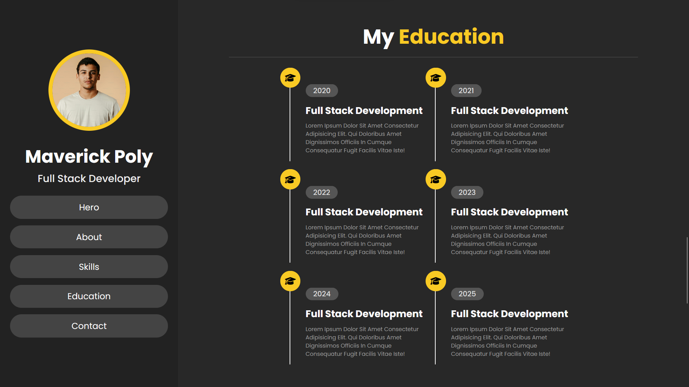
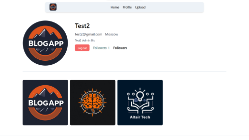
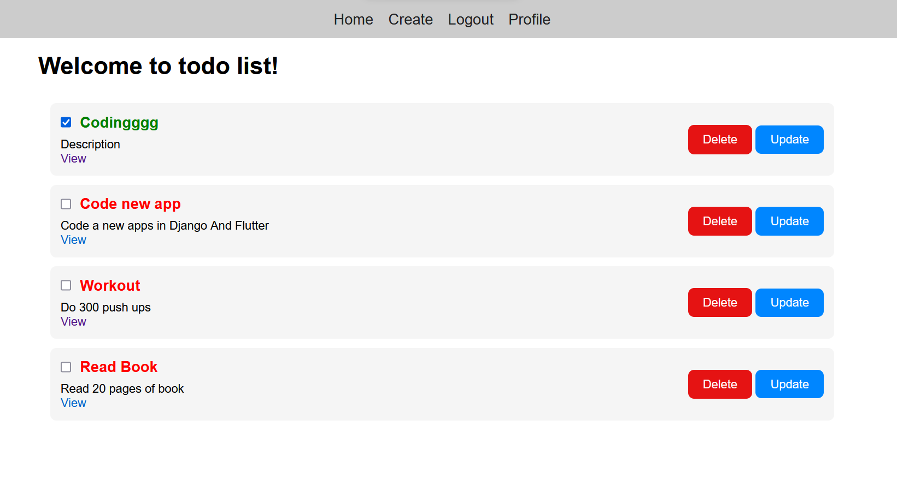
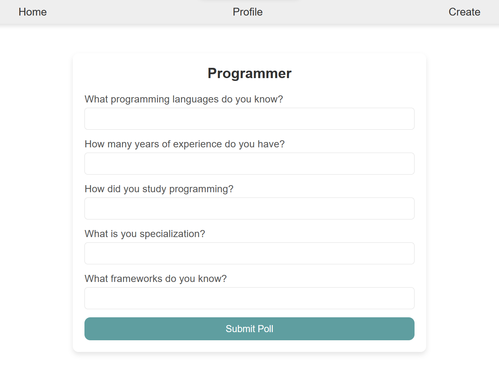
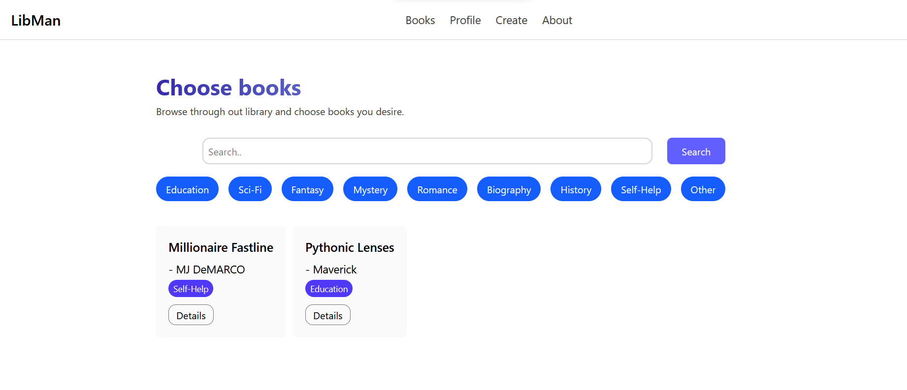
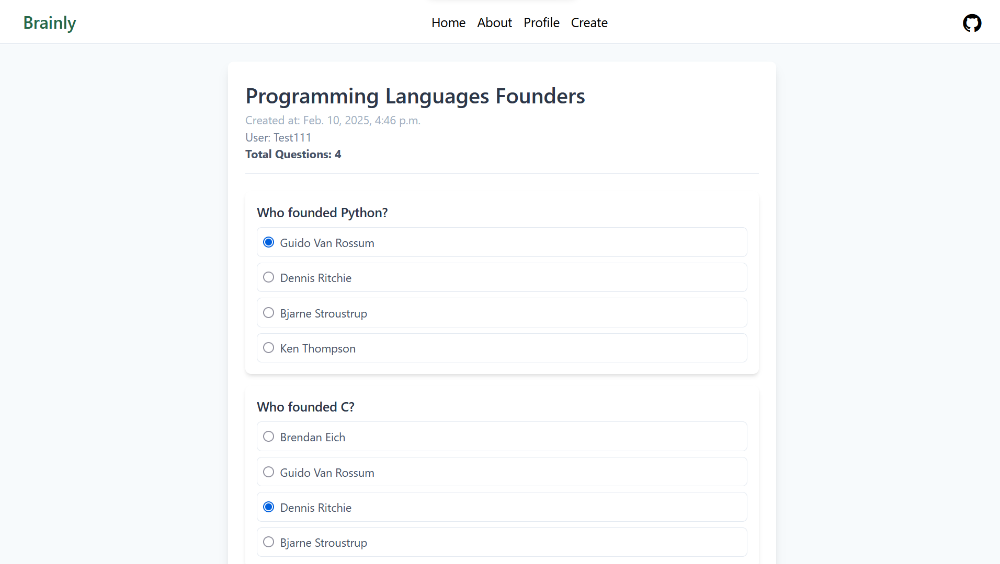

# ASMR Python Django

Welcome to the **ASMR-Python-Django** repository! This project is dedicated to creating 30 Django-based applications to enhance your web development skills. Below, you will find a list of projects with a brief description of each!

## Table of Contents

1. [Beginner Level](#beginner-level)
2. [Intermediate Level](#intermediate-level)
3. [Advanced Level](#advanced-level)
4. [Installation](#installation)
5. [Usage](#usage)
6. [Prerequisites](#[rerequisites)
7. [Contributing](#contributing)
8. [Todo](#todo)
9. [Screenshots](#screenshots)

## Beginner Level

1. **Personal Portfolio Website**: Build a portfolio site to showcase your projects, skills, and resume. Include a contact form.
2. **Blog Application**: Create a simple blog where users can read, add, edit, and delete posts.
3. **To-Do List App**: Build a to-do list app where users can add, update, mark as complete, and delete tasks.
4. **Quotes App**: Display random quotes with an option for users to add their own favorite quotes.
5. **Weather App**: Create an app that fetches and displays the current weather of a city using an API.
6. **Notes App**: Develop a simple app where users can create and save notes with a title and content with markdown support.
7. **Polls App**: Create a voting application where users can vote on different polls and see the results.
8. **Basic User Authentication System**: Implement login, logout, and signup functionality using Django’s authentication system, and with allauth Github provider.
9. **Contact Form**: Build a contact form that sends emails to the admin when users submit their queries.
10. **URL Shortener**: Create a URL shortener where users can input long URLs and get shortened links.

## Intermediate Level

11. **E-commerce Website**: Build a simple e-commerce platform with product listings, a cart, and a checkout system.
12. **Event Management App**: Develop an app where users can create, view, and register for events.
13. **Library Management System**: Build an app to manage library books, borrowers, and due dates.
14. **Blog with Comments and Likes**: Extend the basic blog app to allow users to comment on posts and like them.
15. **Online Quiz System**: Create an app for taking quizzes, where users can answer questions and get scores.
16. **Recipe Sharing Platform**: Build an app where users can share and browse recipes with categories and ratings.
17. **Expense Tracker**: Create an app where users can track their expenses, categorize them, and view reports.
18. **Job Board**: Build a platform where employers can post jobs and users can search and apply for them.
19. **Chat Application**: Implement a real-time chat app using Django and WebSockets (e.g., Django Channels).
20. **Portfolio Builder**: Allow users to create and customize their own portfolio websites with sections like "About Me" and "Projects."

## Advanced Level

21. **Social Media App**: Build a mini social media platform with user profiles, posts, followers, and likes.
22. **Learning Management System (LMS)**: Create a platform for managing online courses, student progress, and assignments.
23. **News Aggregator**: Build an app that fetches and displays news from multiple sources using APIs.
24. **Multi-Tenant SaaS Application**: Develop a Software-as-a-Service platform supporting multiple tenants with separate databases.
25. **Customer Relationship Management (CRM) System**: Create a CRM system to manage customer interactions, sales pipelines, and analytics.
26. **Online Marketplace**: Build a marketplace app where users can buy, sell, and review products.
27. **Task Management Tool**: Create a project management tool with features like task assignment, deadlines, and progress tracking.
28. **Blog with Markdown Support**: Enhance a blog app to support Markdown for rich text formatting.
29. **Inventory Management System**: Build an app to track and manage stock levels, sales, and suppliers for a business.
30. **Subscription-Based Content Platform**: Develop a platform with paid subscription access to exclusive content (e.g., videos, articles).

## Installation

To get started with any of the projects, follow these steps:

1. Clone the repository:

   ```bash
   git clone https://github.com/MaverickPoly/asmr-python-django.git
   ```

2. Navigate to the project directory:

   ```bash
   cd asmr-python-django
   ```

3. Create a virtual environment and activate it:

   ```bash
   python -m venv env
   env\\Scripts\\activate
   ```

4. Install the required dependencies:

   ```bash
   pip install -r requirements.txt
   ```

5. Navigate to individual project:

   ```bash
    cd 1.PersonalPortfolio
    cd personal_portfolio
   ```

## Usage

Each project is located in its respective directory. Navigate to the desired project folder and run the development server:

```bash
python manage.py runserver
```

Access the application in your web browser at `http://127.0.0.1:8000/`.

## Prerequisites

1. Python Interpreter
2. All the libraries and modules in `requirements.txt` file.
3. Some kind of code editor, like VSCode or Pycharm.

## Contributing

Contributions are always welcome! If you have any suggestions or improvements, feel free to open an issue or submit a pull request. Also feel free to give this repository a star ⭐🌟

1. Fork the repository.
2. Create a new branch:
   ```bash
   git checkout -b feature/your-feature-name
   ```
3. Make your changes and commit them:
   ```bash
   git commit -m 'Add some feature'
   ```
4. Push to the branch:
   ```bash
   git push origin feature/your-feature-name
   ```
5. Open a pull request.

## Todo

As you see, not all of the projects are implemented yet. The remaining 15 projects will be implemented step by step in a few months, which are from 15 to 30. Only first 15 projects are completed.

## Screenshots

Visuals of each project:

### 1.Personal Portfolio



### 2.Blog App



### 3.Todo List App



### 7.Polls App



### 13. Library Management System



### 15. Quiz App


